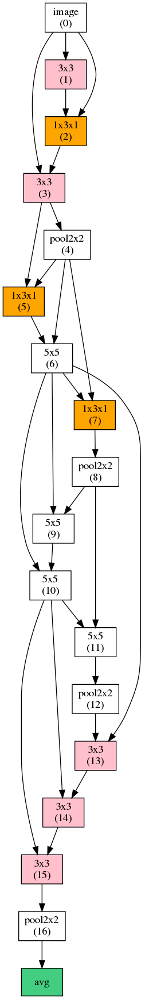

# Efficient Neural Architectures Search (ENAS) in PyTorch

PyTorch implementation of [Efficient Neural Architecture Search via Parameters Sharing](https://arxiv.org/abs/1802.03268).Most of my codes heavily carried from[[carpedm20]]("https://github.com/carpedm20/ENAS-pytorch")

**ENAS** reduce the computational requirement (GPU-hours) of [Neural Architecture Search](https://arxiv.org/abs/1611.01578) (**NAS**) by 1000x via parameter sharing between models that are subgraphs within a large computational graph. SOTA on 'cifar-10 datasets' cnn architecture construction.

## Prerequisites

- Python 3.6+
- [Pytorch 0.3.0](http://pytorch.org/)
- tqdm, scipy, imageio, graphviz, tensorboardX

Install prerequisites with:

    conda install graphviz
    pip install -r requirements.txt

To train **ENAS** to discover a recurrent cell for RNN:

    python main.py --network_type rnn --dataset ptb --controller_optim adam --controller_lr 0.00035 \
                   --shared_optim sgd --shared_lr 20.0 --entropy_coeff 0.0001

    python main.py --network_type rnn --dataset wikitext

To train **ENAS** to discover CNN architecture (in progress):

    python main.py --network_type cnn --dataset cifar --controller_optim momentum --controller_lr_cosine=True \
                   --controller_lr_max 0.05 --controller_lr_min 0.0001 --entropy_coeff 0.1

or you can use your own dataset by placing images like:

    data
    ├── YOUR_TEXT_DATASET
    │   ├── test.txt
    │   ├── train.txt
    │   └── valid.txt
    ├── YOUR_IMAGE_DATASET
    │   ├── test
    │   │   ├── xxx.jpg
    │   │   ├── yyy.jpg
    │   │   └── ...
    │   ├── train
    │   │   ├── xxx.jpg
    │   │   └── ...
    │   └── valid
    │       ├── xxx.jpg
    │       └── ...
    ├── image.py
    └── text.py
and you can use Pytorch's package torchvision to download cifar-10 datasets
"""NOTICED THAT*** I don't have implement the function that generate gif due to my laze

## Results
Efficient Neural Architecture Search (**ENAS**) is composed of two sets of learnable parameters, controller LSTM *θ* and the shared parameters *ω*. These two parameters are alternatively trained and only trained controller is used to derive novel architectures.

### 1. Discovering Recurrent Cells

You can find this implementation on [[carpedm20]]("https://github.com/carpedm20/ENAS-pytorch")

### 2. Discovering Convolutional Neural Networks

Controller LSTM samples 1) what computation operation to use and 2) which previous node to connect.

The CNN network **ENAS** discovered for `CIFAR-10` dataset:

 

#### macro
Due to the limited of computational resources, only use 12 layers to build the model.
Best discovered ENAS cell for `cifar 10` at epoch 40:

#### micro
(in process))

### 3. Designing Convolutional Cells
(in process)

## Reference

- [Neural Architecture Search with Reinforcement Learning](https://arxiv.org/abs/1611.01578)
- [Neural Optimizer Search with Reinforcement Learning](https://arxiv.org/abs/1709.07417)

## Author
 [[lianqing]](http://lianqing11.github.io/)
 Anyway, this code are heavily carried from from[[carpedm20]]("https://github.com/carpedm20/ENAS-pytorch") and I learnt a lot from it , if you have any copyright problem, please feel free to talk to me!
